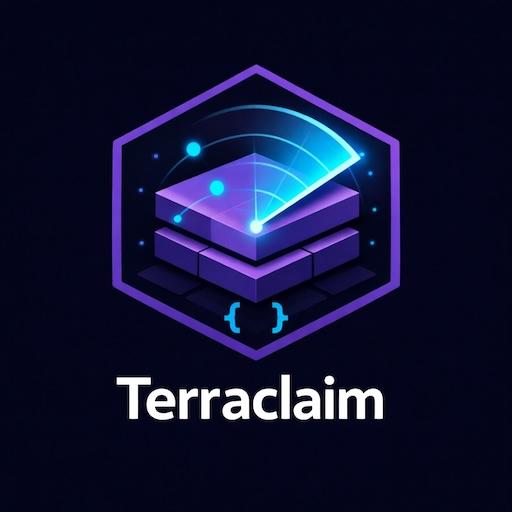

<p align="center">
  
</p>

# Terraclaim

[](https://github.com/andrewbakercloudscale/terraclaim/releases)
[](LICENSE)
[](https://github.com/andrewbakercloudscale/terraclaim/actions/workflows/shellcheck.yml)

Claim your AWS estate as Terraform — using scripts, not click-ops.

`terraclaim` scans your AWS account(s) and generates ready-to-use Terraform
`import {}` blocks (Terraform >= 1.5) together with resource skeletons and S3
remote-state backends.  After running the script you can execute
`terraform plan -generate-config-out=generated.tf` in any service directory to
capture the full live configuration automatically.

Explained in detail on the blog:
<https://andrewbaker.ninja/2026/03/21/reverse-engineering-your-aws-estate-into-terraform-using-terraclaim-org/>

---

## Requirements

| Tool | Minimum version |
|------|----------------|
| AWS CLI | 2.x |
| Terraform | 1.5 |
| jq | 1.6 |
| Bash | 4.x |

```bash
aws sts get-caller-identity   # verify credentials
terraform version             # must be >= 1.5
jq --version
```

---

## Quick start

```bash
git clone https://github.com/andrewbakercloudscale/terraclaim.git
cd terraclaim
chmod +x terraclaim.sh reconcile.sh drift.sh examples/*.sh
```

### 1. Dry-run — preview resource counts without writing files

```bash
./terraclaim.sh \
  --regions "us-east-1" \
  --services "ec2,vpc,rds" \
  --dry-run
```

### 2. Single account with S3 remote state

```bash
./terraclaim.sh \
  --regions "us-east-1,eu-west-1" \
  --services "ec2,eks,rds,s3,vpc" \
  --state-bucket my-tf-state-prod \
  --state-region us-east-1 \
  --output ./tf-output
```

### 3. Multi-account organisation sweep

```bash
./terraclaim.sh \
  --accounts "123456789012,234567890123,345678901234" \
  --role OrganizationAccountAccessRole \
  --regions "us-east-1,eu-west-1,ap-southeast-2" \
  --state-bucket my-tf-state-org \
  --output ./tf-output \
  --debug
```

### 4. Named AWS profile

```bash
./terraclaim.sh \
  --profile prod-readonly \
  --regions "eu-west-1" \
  --services "ec2,vpc,rds,eks" \
  --output ./tf-output
```

---

## Options

| Flag | Description | Default |
|------|-------------|---------|
| `--accounts` | Comma-separated account IDs | Current account |
| `--regions` | Comma-separated regions | `us-east-1` |
| `--services` | Comma-separated services (see below) | All supported services |
| `--profile` | AWS named profile (`AWS_PROFILE`) | — |
| `--role` | IAM role name to assume in each account | — |
| `--state-bucket` | S3 bucket for remote state `backend "s3"` | — (local state) |
| `--state-region` | Region of the state S3 bucket | Same as resource region |
| `--output` | Root output directory | `./tf-output` |
| `--parallel` | Max concurrent service scans | `5` |
| `--exclude-services` | Comma-separated services to skip | — |
| `--tags` | Only import resources with these tags e.g. `"Env=prod,Team=sre"` | — |
| `--resume` | Skip account/region/service combos already written | `false` |
| `--dry-run` | Print resource counts; do not write files | `false` |
| `--debug` | Verbose logging | `false` |
| `--version` | Print version and exit | — |

---

## Supported services

| Category | Services |
|----------|---------|
| Compute | `ec2`, `ebs`, `ecs`, `eks` (clusters, node groups, addons, Fargate profiles), `lambda` |
| Networking | `vpc` (VPCs, subnets, security groups, route tables, IGWs, NAT gateways), `elb`, `cloudfront`, `route53`, `acm`, `transitgateway`, `vpcendpoints` |
| Data | `rds`, `dynamodb`, `elasticache`, `msk`, `s3`, `efs`, `opensearch`, `redshift`, `documentdb` |
| Streaming | `kinesis` (Data Streams + Firehose) |
| Integration | `sqs`, `sns`, `apigateway`, `eventbridge`, `stepfunctions`, `ses` |
| Security & Compliance | `iam` (roles, instance profiles, OIDC providers), `kms`, `secretsmanager`, `wafv2`, `config`, `cloudtrail`, `guardduty` |
| Platform | `ecr`, `ssm`, `cloudwatch`, `backup`, `codepipeline`, `codebuild` |
| Auth | `cognito` (user pools, clients, identity pools — fully paginated) |
| ETL | `glue` (jobs, crawlers, databases, connections) |
| Storage | `fsx` (Windows, Lustre, ONTAP, OpenZFS), `transfer` (SFTP/FTPS servers + users) |
| App Platform | `elasticbeanstalk`, `apprunner`, `lightsail` |
| Analytics | `athena` (workgroups + data catalogs), `lakeformation`, `memorydb` |
| Governance | `servicecatalog` (portfolios + products) |

---

## Output structure

```
tf-output/
├── summary.txt
└── 123456789012/
    ├── us-east-1/
    │   ├── ec2/
    │   │   ├── backend.tf
    │   │   ├── imports.tf
    │   │   └── resources.tf
    │   ├── eks/
    │   ├── lambda/
    │   │   └── _packages/
    │   └── rds/
    └── eu-west-1/
```

### Generated files

**`backend.tf`** — S3 remote state configuration + provider block.

**`imports.tf`** — One `import {}` block per discovered resource, e.g.:

```hcl
import {
  to = aws_eks_cluster.cluster_production
  id = "production"
}
```

**`resources.tf`** — Empty resource skeletons matching the import blocks.

---

## Populating configuration from live state

For each service directory:

```bash
cd tf-output/123456789012/us-east-1/eks
terraform init
terraform plan -generate-config-out=generated.tf
```

Terraform reads live state and writes a fully-populated `generated.tf`.
Review it, remove any computed / read-only attributes that would cause a diff,
then commit as your Terraform baseline.

---

## Automating the plan step with run.sh

Instead of running `terraform init` + `terraform plan` manually in every service directory,
use `run.sh` to process the entire output tree in one command:

```bash
# Process every service directory under tf-output
./run.sh --output ./tf-output

# Limit to specific accounts, regions, or services
./run.sh --output ./tf-output --regions "us-east-1" --services "ec2,eks,rds"

# Only run terraform init (skip the plan)
./run.sh --output ./tf-output --init-only

# Preview which directories would be processed
./run.sh --output ./tf-output --dry-run

# Run up to 5 terraform processes in parallel (default: 3)
./run.sh --output ./tf-output --parallel 5
```

Each service directory gets a `.run.log` file. A summary at the end shows which
directories succeeded, had no changes, or failed.

### run.sh options

| Flag | Description | Default |
|------|-------------|---------|
| `--output` | Output directory from `terraclaim.sh` | `./tf-output` |
| `--services` | Limit to specific services | All |
| `--regions` | Limit to specific regions | All |
| `--accounts` | Limit to specific accounts | All |
| `--parallel` | Max concurrent terraform runs | `3` |
| `--init-only` | Only run `terraform init`, skip plan | `false` |
| `--dry-run` | Print directories; do not run terraform | `false` |
| `--debug` | Verbose logging | `false` |

---

## Checking coverage with reconcile.sh

After exporting, verify you haven't missed any resources by comparing the output
against AWS Resource Explorer:

```bash
# Dry run — preview without querying Resource Explorer
./reconcile.sh --output ./tf-output --dry-run

# Full reconciliation
./reconcile.sh --output ./tf-output --index-region us-east-1
```

Sample output:

```
Summary
-------
Total resources (Resource Explorer):  847
Matched to exported import blocks:    801
Potentially missed:                    46
Coverage:                              94%
```

Resource Explorer must be enabled with an **aggregator index** in `--index-region`.

---

## Detecting drift with drift.sh

After establishing a Terraform baseline, use `drift.sh` to detect resources that have
been created or deleted outside of Terraform. Unlike `reconcile.sh`, drift detection
requires no additional AWS services — it uses only the AWS CLI.

```bash
# Report only — see what has changed without touching any files
./drift.sh --output ./tf-output --regions "us-east-1"

# Scope to specific services
./drift.sh --output ./tf-output --regions "us-east-1" --services "ec2,rds,eks"

# Apply — update imports.tf in place (adds new blocks, comments out deleted ones)
./drift.sh --output ./tf-output --regions "us-east-1" --apply

# Save report to file
./drift.sh --output ./tf-output --apply --report ./drift-report.txt
```

Sample output:

```
Terraclaim Drift Report
Generated: 2026-03-24T10:00:00Z
=======================================================

  123456789012 / us-east-1 / ec2
  -------------------------------------------------------
  NEW  (2 resource(s) found in AWS, not in imports.tf)
    + aws_instance.web_server_new  (id: i-0abc123def456)
    + aws_instance.batch_worker    (id: i-0def789abc012)
  REMOVED  (1 resource(s) in imports.tf, no longer in AWS)
    - aws_instance.old_bastion     (id: i-0111222333444)

=======================================================
Summary
-------
Unchanged:               22
New (not yet imported):   2
Removed (stale):          1

Run with --apply to update imports.tf files automatically.
```

### drift.sh options

| Flag | Description | Default |
|------|-------------|---------|
| `--output` | Output directory from `terraclaim.sh` | `./tf-output` |
| `--accounts` | Comma-separated account IDs | Current account |
| `--regions` | Comma-separated regions | `us-east-1` |
| `--services` | Comma-separated services | All supported services |
| `--profile` | AWS named profile (`AWS_PROFILE`) | — |
| `--role` | IAM role to assume in each account | — |
| `--apply` | Update `imports.tf` in place | `false` |
| `--report` | Write report to file in addition to stdout | — |
| `--parallel` | Max concurrent service scans | `5` |
| `--exclude-services` | Comma-separated services to skip | — |
| `--debug` | Verbose logging | `false` |

---

## Recommended workflow

1. Run with `--dry-run` to verify resource counts and permissions.
2. Export a single region with your highest-priority services (use `--parallel 5` for speed).
3. Run `run.sh --output ./tf-output` to execute `terraform init` + `terraform plan` across all service directories automatically.
4. Review `generated.tf` in each directory; remove computed / read-only attributes.
5. Run `reconcile.sh` to identify gaps (requires AWS Resource Explorer).
6. Commit the baseline on a `baseline-import` branch.
7. Refactor incrementally via pull requests.
8. Run `drift.sh` regularly (or in CI) to catch resources created outside Terraform.
9. Use `--exclude-services` to skip services managed by a different team or tool.

---

## IAM permissions

The principal running the script needs read-only access to each service.
A minimum policy should include actions such as:

- `ec2:Describe*` — instances, volumes, VPCs, subnets, security groups, route tables, IGWs, NAT gateways
- `eks:List*`, `eks:Describe*` — clusters, node groups, addons, Fargate profiles
- `rds:Describe*`, `docdb:Describe*`
- `s3:ListAllMyBuckets`, `s3:GetBucketLocation`
- `lambda:ListFunctions`, `lambda:GetFunction`
- `iam:ListRoles`, `iam:ListInstanceProfiles`, `iam:ListOpenIDConnectProviders`
- `cognito-idp:ListUserPools`, `cognito-idp:ListUserPoolClients`
- `cognito-identity:ListIdentityPools`
- `resource-explorer-2:Search`, `resource-explorer-2:GetIndex` (for `reconcile.sh`)
- `sts:AssumeRole` (for multi-account sweeps)
- `resourcegroupstaggingapi:GetResources` (for `--tags` filtering)

---

## Testing

The `tests/` directory contains a [bats-core](https://bats-core.readthedocs.io/) test suite
that exercises `terraclaim.sh` and `drift.sh` using a mock AWS CLI — no real AWS credentials
or account needed.

**Install bats-core:**

```bash
# macOS
brew install bats-core

# Linux / CI
git clone https://github.com/bats-core/bats-core.git
sudo bats-core/install.sh /usr/local
```

**Run tests:**

```bash
bats tests/terraclaim.bats
bats tests/drift.bats

# Run both
bats tests/
```

The mock AWS CLI (`tests/helpers/mock_aws.bash`) intercepts every `aws` subcommand and
returns fixture data set per-test via `mock_response`. Real `jq` is required.

---

## Contributing

See [CONTRIBUTING.md](CONTRIBUTING.md).

## License

[MIT](LICENSE)
